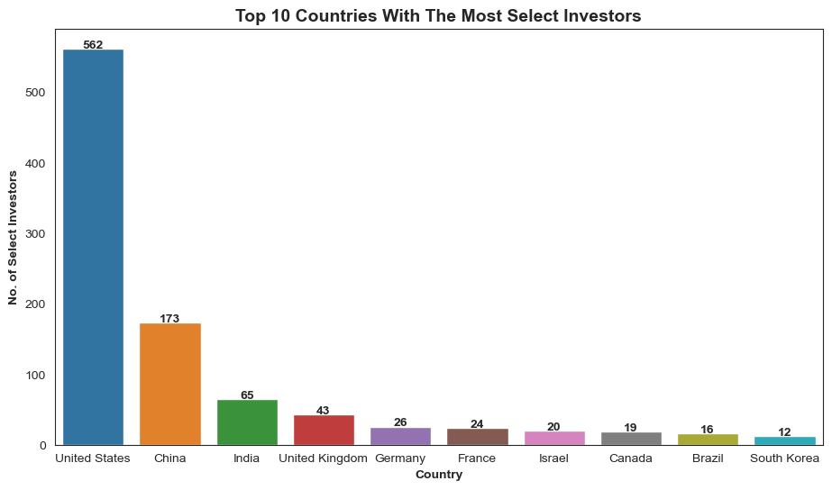
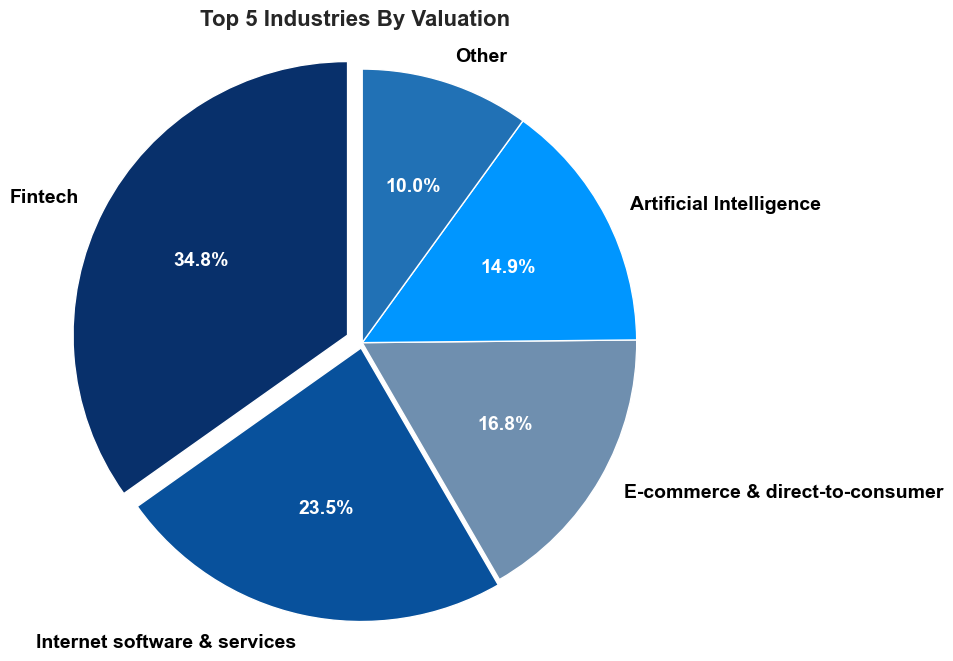
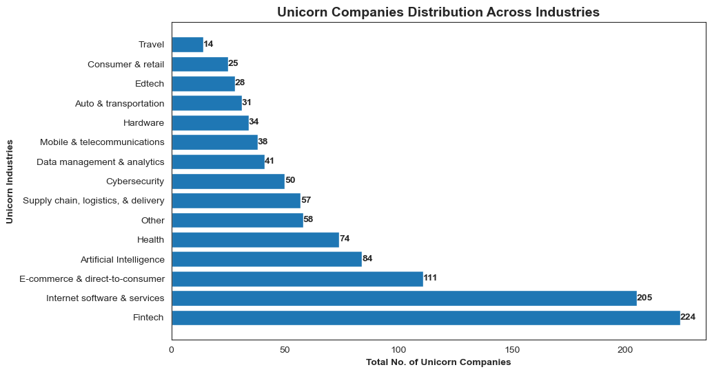
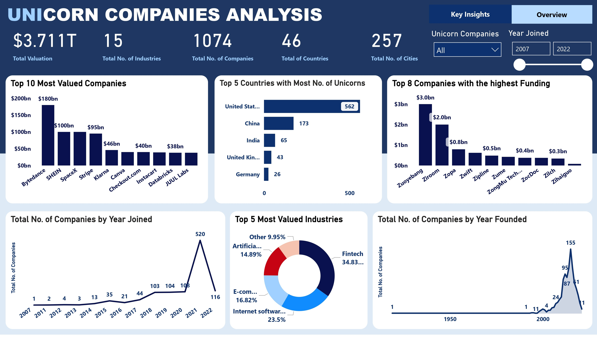
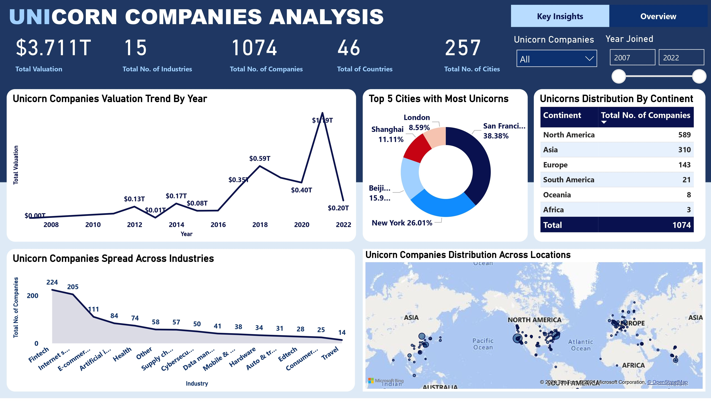

# Exploratory Data Analysis Of Global Unicorn Companies

 

## Table of Contents
- [Project Overview](#project-overview)
- [Tools Used](#tools-used)
- [Dataset Overview](#dataset-overview)
- [Global Unicorn Companies Data EDA In Python](#global-unicorn-companies-data-eda-in-python)
- [Data Analysis and Visuals in Power BI](#data-analysis-and-visuals-in-power-bi)
- [Factors That Influences The Emergence of Unicorns](#factors-that-influences-the-emergence-of-unicorns)
- [Recommendations Towards The Growth of Unicorn Companies](#recommendations-towards-the-growth-of-unicorn-companies)
- [View Power BI Dashboard Report](#view-power-bi-dashboard-report)
 

## Project Overview
### Introduction:

The emergence of "unicorn" companies, private startups valued at over $1 billion, has reshaped the global economy and investment landscape. This data analysis project aims to explore the evolution, evolvement, and growth of these unicorns from 1919, marking the inception of the first unicorn, through to 2021. By analyzing historical data, trends, and significant events, this project seeks to provide insights into the factors contributing to the rise of unicorn companies and their impact on various industries and economies.

### Problem Statement
- What is the total valuation of Unicorns by 2022?
- What are tyhe total number of industries and unicorn companies in this analysis?
- Which companies are the most valued unicorns?
- Which countries host a majority of the unicorns?
- Which companies has the highest funding from investors?
- Which industries are the mostr valued?
- Which cities have the most concentration of unicorn companies?
- When was this Unicorn companies founded? Show a yearly trend.
- When did these companies emerge as unicorns? Show a yearly trend.
- What is the valuation trend of these companies?
- How are these unocorn companies spread across industries and locations?
  
#### Objectives:
- Determine the total valuation of unicorn companies by 2022.
- Identify the total number of industries represented by unicorn companies and quantify the total count of unicorn companies within this analysis.
- Rank and highlight the most valued unicorn companies based on their valuation metrics.
- Analyze and map the distribution of unicorn companies across countries to identify regions hosting the majority of unicorns.
- Identify and analyze the unicorn companies receiving the highest funding from investors.
- Evaluate and determine the most valued industries among unicorn companies.
- Utilize spatial analysis to identify cities with the highest concentration of unicorn companies.
- Present a yearly trend analysis showcasing the founding dates of unicorn companies to understand their emergence over time.
- Provide a yearly trend analysis illustrating the emergence of unicorn companies over time.
- Analyze the valuation trend of unicorn companies to identify patterns and fluctuations.
- Explore and visualize the distribution of unicorn companies across industries and locations to understand their spread and concentration dynamics.
 
 

### Tools Used
1. Python (Was used for Data Cleaning, profilling and Exploratory Data Analysis)
    - The following Python Features were incorporated:
        1. Jupiter Notebook
        2. Numpy
        3. pandas
        4. Visualization
             - Matplotlib
             - Seaborn
             - Plotly
        5. Integration With Other tools
           
2. Power BI (Was used to create reports and dashboard for this analysis)
    - The following Power BI Features were incorporated:
        1. Bookmarking
        2. DAX
        3. Quick Measures
        4. Page Navigation
        5. Modelling
        6. Filters
        7. Tooltips
        8. Button
 
 

### Methodology (Python):
- __Data Collection:__ Gather historical data on unicorn companies from reputable sources.
- __Data Cleaning and Validation:__ Ensure accuracy and consistency of the collected data through rigorous validation and cleaning processes.
- __Descriptive Analysis:__ Perform descriptive statistics to analyze trends in the number of unicorn companies over time, geographical distribution, and industry sectors.
- __Time Series Analysis:__ Utilize time series techniques to identify patterns, cycles, and fluctuations in unicorn company growth.
- __Comparative Analysis:__ Compare the characteristics and performance of unicorn companies across different regions and industries.
- __Regression Analysis:__ Conduct regression analysis to identify factors influencing the valuation and success of unicorn companies.
 

**Data Preprocessing:**
- Convert the Funding Column from a __"string"__ to a __"float"__.
- Define a custom function to convert the string to Decimal
- Remove the __'$'__ signs from the string
- Extract the numerical part of the string
- Get the last character to determine the scale (Billion or Million)
- Multiply the numeric value based on the scale
- Re-add the __'$'__ sign and return as a Decimal object
 

### Exploratory Data Analysis (EDA):
- Conduct EDA to gain insights into Global Unicorn Companies emergence, evolvement over the years, industries, funding, locations and valuation with line charts, bar charts, doughnut charts, pie charts, funnels and maps.
 

### Statistical Analysis:

- Calculate descriptive statistics, including mean, median, standard deviation, and correlation coefficients, to quantify Global Unicorn Companies valuation and funding trends over the years.
 

### Expected Findings:

- __Growth Trajectory:__ A steep increase in the number of unicorn companies, especially in technology and finance sectors, with notable spikes following periods of economic growth and technological innovation.
- __Geographical Distribution:__ Concentration of unicorn companies in tech hubs such as Silicon Valley, but with a rising presence in other regions globally, reflecting the globalization of entrepreneurship and venture capital.
- __Industry Trends:__ Dominance of technology-related sectors, including e-commerce, fintech, and software, but also significant presence in healthcare, transportation, and energy industries.
- __Funding Dynamics:__ Shifts in funding sources and strategies, from early-stage venture capital to late-stage private equity and crossover investments, influencing unicorn company valuations and exit strategies.
- __Impact on Economy:__ Contribution of unicorn companies to job creation, wealth generation, and innovation, but also concerns about market concentration, regulatory challenges, and potential bubble risks.
 
 

### Dataset Overview
The primary dataset used in this analysis is the "Unicorn_Companies.csv" and "Data_Dictionary-1.csv" files. This dataset was provided by [Quantum Analytics](https://www.quantumanalyticsco.org/). The Data Dictionary can be viewed or downloaded [here](Data/Data_Dictionary.csv) while the main dataset can also be viewed and downloaded [here](Data/Unicorn_Companies.csv). The main dataset is made up of data for Global Unicorn Companies from the founding of the first Unicorn company in 1919 to the year 2022. The Data Dictionary file gives an explanation of the fields in the main dataset. The main dataset has the columns: Company, Valuation, Date Joined, Industry, City, Country, Continent, Year Founded, Funding, and Select Investors.

The dataset contains 8 columns and 1,075 rows of data, here's a breakdown of what each column represents:

| Table                              | Field                    | Description                            |            
|:-----------------------------------|:------------------------ |:-------------------------------------- |
|Unicorn Companies                   | Company                  | Contains the names of the unicorn companies included in the dataset   |
|                                    | Valuation                | Contains the valuation of each unicorn company, measured in terms of billion dollars ($1 billion or more), which represents the estimated worth of the company in the marketContains data related to the profitability of e-commerce sales through INCREFF     |
|                                    | Date Joined              | Contains the date when each company achieved unicorn status, which means the date when their valuation exceeded $1 billion.         |
|                                    | Industry                 | Contains the industry or sector to which each unicorn company belongs. It specifies the primary area of business or the market in which the company operates.Unique identifier for each design         |
|                                    | City                     | Contains the city where each unicorn company is headquartered or has a significant presence        |
|                                    | Country                  | Contains the country where each unicorn company is based or founded         |
|                                    | Continent                | Contains the continent where each unicorn company's country is located        |
|                                    | Year Founded             | Contains the year when each unicorn company was established or founded         |
|                                    | Funding                  | Contains information about the total funding raised by each unicorn company, which represents the cumulative amount of investment capital received from investors.        |
|                                    | Select Investors         | Contains the names of notable investors or investment firms that have provided funding to each unicorn company. It may include venture capital firms, private equity investors, or other institutional investors        |
 

#### Conclusion:

From 1919 to 2022, the evolution of unicorn companies has borne out a powerful driver of change in the global economy. It reshapes industries. Indeed, it drives innovation and attracts unprecedented investments. Understanding very well the drivers of growth and success, policymakers, investors, and entrepreneurs would be better placed to navigate opportunities and challenges resulting from the unicorn phenomenon. The analysis offers valuable insight. This analysis project attempts to look at the past and the present. In this project, the present and the future of unicorn companies are discussed. This study estimated the effect that these companies have on the world's economy.
 

## Global Unicorn Companies Data EDA In Python:

Top 10 Most Valued Unicorns                   | Top 8 Unocorns With Most Funding        
:--------------------------------------------:|:--------------------------------------------:|
 | 

Top 10 Countries With Most Select Inveastors               |Top 10 Select Investors By Funding 
:---------------------------------------------------------:|:------------------------------------------------------:|
|  

Top 5 Cities With Most Unicorns Concentration                  |Top 5 Countries With Most Unicorms 
:-------------------------------------------------------------:|:--------------------------------------------------:|
|

Top 5 Industries By Valuation                |Unicorns Distribution Across Industries 
:-------------------------------------------:|:----------------------------------------------------------------:|
|

Unicorns Trend By Year Founded                |Unicorns Trend By Year Joined 
:--------------------------------------------:|:----------------------------------------------------------------:|
|
  

To view the complete Exploratory Data Analysis (EDA) of this project in python Jupiter Notebook, please click [here](Unicorn_Companies_Exploratory_Data_Analysis.ipynb)
 
 

## Data Analysis and Visuals in Power BI:
#### Key Insights

#### Overview

 
 

### Project Analysis:
1. From the dashboard, it is observed that the total Uunicorn Valuation as of 2022 is __$3.711T__. 
2. The Total number of Unicorn Companies is 1074 and total number of industries is __15__.
3. For Location, the total number of Unicorn Cities is __257__, while the number of Unicorns Countries is __46__.
5. The top Unicorn Industries happens to be in the Tech Industry. The Fintech tops this list with 224 Unicorns, nternet Software & Services has __205__, E-Commerce & Direct-To-Consumer has __111__, while Artificial Intelligence has __84__.
6. Bytedance sits at the top of the most valued Unicorns with a valuation of __$180bn__, Shein and SpaceX follows with __$100bn__, Stripe comes next with __$95bn__.
7. From just __1__ Company emerging as a Unicorn in 2007 to 2021 when the number of Companies that became Unicorns just in that same year peaked at __520__. Factors that brought this this disruption can be attributed to advancement of technology of the global economy, the tech industries advantage, the edge of innovative startups, the prevailing market condition of that period and more.
8. 2022 saw a downward trend and a decline in the number of Companies that emerged as Unicorns with __112 Companies__ joining. This downward trend can be attributed to the negative effects of the pandemic which slowed down consumer spending and this resulted to decreased investment. The effect of this also came as a result of the volatility in the financial markets which made it difficult for startups to raise capital.
9. A complete PowerPoint Prentation in __PDF__ of this project analysis can be viewed [here](EDA%20OF%20GLOBAL%20UNICORNS%20USING%20PYTHON%20-%20ODINAKACHUKWU%20UGOCHUKWU%20NNANNA.pdf)
 

## Factors That Influences The Emergence of Unicorns
- __Variation in Timeline:__ Their emergence into the league of unicorn companies can depend on factors such as their industry, their market conditions, their business model, and finally, money. 
- __The Technological Advantage:__ The technology sector has been growing fast in the recent past. For example, areas of software development, e-commerce, and Internet services have been witnessing rapid revolutions, disruptions, and rapid development. This simply proved that investors will more likely to invest in the technology sector.
- __Innovative Startup Edge:__ In the past decade, the world has seen the sprouting of quite a good number of innovative startups. Essentially, the surge also attracted a good number of investors into raising capital funding for the startups, thereby helping many to hit and even surpass the $1 billion mark.
- __The Global Economy:__ The interconnectivity of the world economy has rapidly taken over with the help of technology, enabling the growth of those companies, in turn, with potentials that can emerge as unicorns in their own right. Revision In reaching out to the world for international investors, better utilization of digital platforms for marketing, and running distribution, much has contributed to making it feasible to achieve unicorn status for companies.
- __Prevailing Market Conditions:__ The market and economic conditions also play a very vital role. Periods of strong growth and high investor confidence may favor firms by accessing the funds easily that would help them scale at a rapid pace to achieve unicorn status.
 
 

## Recommendations Towards The Growth of Unicorn Companies
- __Strategic Vision and Clarity:__ Holds a clear and compelling long-term vision of the future for the corporation. It guides strategic decisions authoritative for stakeholders to buy into and inspires the team. Long-term goals need to be well-defined, together with how to get there.
- __Strategic Partnerships and Alliances:__ Explore strategic partnerships and alliances that can speed up growth. This includes collaboration with complementary businesses, alliances with leaders in the industry, or joint ventures that will give access to new markets, technologies, or resources.
- __Scalability and Operational Efficiency:__ Make sure that operations in the company are scalable. Invest in technologies and processes that have the potential to scale up efficiently without affecting the quality. It is operation excellence that helps manage growth effectively.
- __Data-Driven Decision-Making:__ Embrace data-driven decision-making. Leverage big data analytics to engender insights on customer behavior, market trends, and internal operations that would enable a company to adopt more effective strategies and resource allocation with informed decisions.
- __Financial Discipline:__ Practice financial discipline and transparency. Report proper financial management practices, track key performance indicators, and strategically allocate resources. A sound company in the financial aspect is one that enjoys exponential health.
- __Global Expansion and Internationalization:__ Consider expansion opportunities globally. Many unicorn enterprises generally have the propensity to be able to operate globally. Global expansion can open up new markets, customer bases, and revenue streams.
 
 

## View Reports In Power BI
Here’s a link to the reports I created in the second phase of this project - [Reports](https://app.powerbi.com/view?r=eyJrIjoiNTgxOTQ1N2QtM2RmOS00OTQzLWFiOTgtMTY4YjEwMzY4NTlmIiwidCI6IjdlYzI5NjU5LTNjZjItNGYzZi1hYmIzLWE3MjJlZGY3ZmYyZCJ9). These reports showcases a vivid visual of this analysis on Global Unicorn Compoanies in Power BI.
 
 

## Thank You For Following Through!

